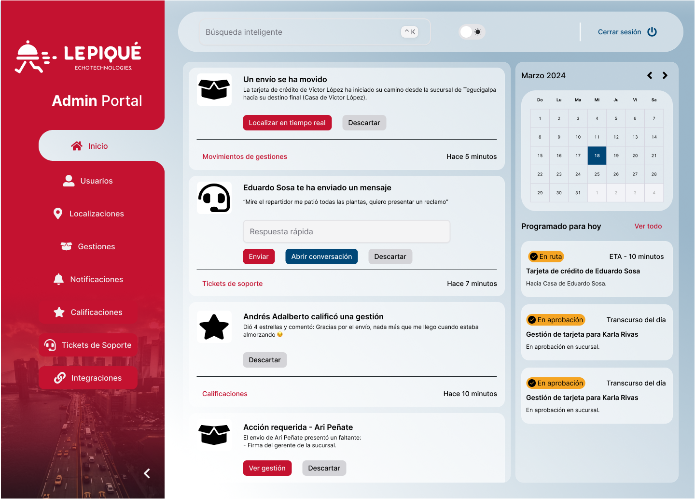

# LEPIQUÉ COURIER & LOGISTICS

## Descripción del proyecto

- El proyecto LEPIQUÉ Courier & Logistics consiste en un servicio de entregade mensajería para un banco el cual
  contendrá
  tracking y entrega de paquetes, tales como tarjetas de crédito, POS, documentos internos, etc. También visualización
  de
  historial de entrega y la gestión necesaria en general. La logística de entrega será geolocalizada en tiempo real y se
  llevará el control mediante un portal administrativo al momento de realizar alguna solicitud. Para esto, se realizará
  una aplicación web y una aplicación móvil en las cuales se podrá visualizar en tiempo real la ubicación del paquete de
  entrega.

- Los usuarios (clientes) y mensajeros recibirán notificaciones sobre el estado real de la solicitud y entrega y
  a la vez se proporcionará una ETA (hora estimada de llegada) precisa para cada entrega. Además, los usuarios y
  mensajeros podrán gestionar todas las entregas en el mismo lugar agregando que también permitirá la comunicación
  bidireccional entre los mismos para solventar algún inconveniente y coordinar la solicitud de entrega. Aparte de esto,
  la aplicación móvil del mensajero tendrá funciones para escanear documentos y actualizar el estado de la entrega. El
  portal web y las aplicaciones móviles tendránuna interfaz intuitiva y fácil de usar siendo inclusivos en el
  entendimiento del sistema para usuarios de todos los niveles de experiencia.

- Además, el sistema podrá integrarse con
  otros sistemas relevantes dentro de la lógica y necesidades del negocio como el sistema de gestiones de entregas de la
  entidad bancaria. La integración debe permitir un flujo de información sin problemas entre los diferentes sistemas y a
  su vez, ser flexible y adaptable a las necesidades específicas de la empresa.

## Integrantes del equipo

| Nombre completo                | Carnet   | Sección técnica |
|--------------------------------|----------|-----------------|
| Víctor René López Huezo        | 20190189 | 1B              |
| Eduardo Daniel Sosa Reyes      | 20220169 | 1B              |
| Karla Reneé Rivas Hernández    | 20200308 | 1B              |
| Edgar Ari Peñate Rivera        | 20220625 | 1B              |
| Andrés Adalberto Flores Alfaro | 20210549 | 1B              |
